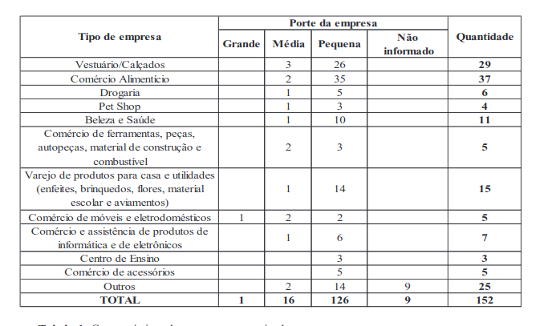
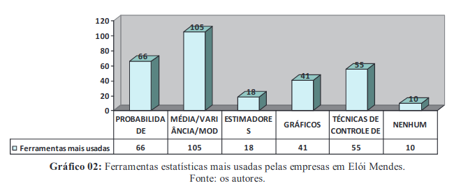

`população`

"Por exemplo, ao analisar quantas pessoas estudam em escola privada e quantas pessoas estudam em escola pública numa cidade, têm-se como população as pessoas, como parâmetro homens e mulheres, como variável os estudantes e dados seria quantas pessoas foram analisadas. A amostra nesta situação anterior seria uma parcela do total da população para analisar"

`amostra`

"Das 200 empresas que tiveram acesso ao questionário, 76% responderam todas as perguntas. A amostra contém 5% de erro de amostragem. Em relação às justificativas de cada resposta que não havia obrigatoriedade em responder, apenas 59 empresas justificaram. Tais justificativas foram fundamentais para elaboração da conclusão do artigo, juntamente com comentários na entrevista pessoal. O questionário da entrevista se encontra na seção de anexos desse artigo"

`parâmetro`

76% responderam todas as perguntas

`estatística`

não achei estatística no artigo

`dados`

</img>

`variável quantitativa discreta`

</img>
